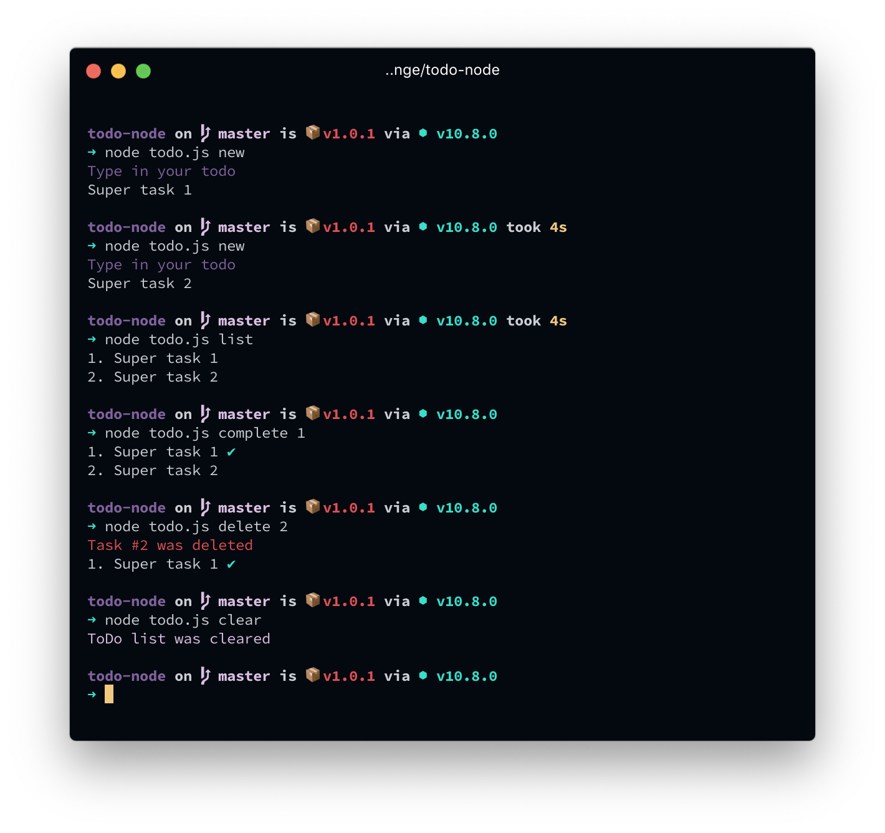

# ToDo app written in node.js

[](https://forthebadge.com)

> Uploaded as alfredik

[](https://forthebadge.com)

## Install

```zsh
npm install alfredik -g
```

## Run in dev mode

```sh
# go to the directory
cd todo-node

# install node packages
npm i
```

## Usage

via npm

```zsh
alfredik new
```

dev mod

```zsh
./todo.js new
```

```zsh
todo <command>

  commands can be:

  new:          used to create a new todo
  list:         used to retrieve your todos
  complete <i>: used to mark a todo as complete by index
  delete <i>:   used to delete a todo by index
  clear:        used to delete all todos
  export:       used to export todos to current directory
  help:         used to print the usage guide
```

## ToDo

- [x] Prepare app for publishing on npm
- [x] Register app on npm
- [x] Add export function
- [ ] Add telegram integration (or some other)



Chpok Сhelebok production @ 2018